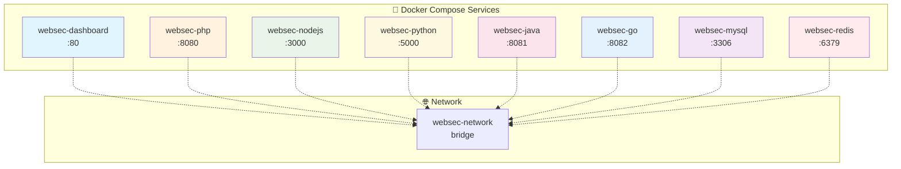

# WebSec-Lab v2 🛡️

**실전 웹 보안 취약점 테스트 플랫폼**

> 🎯 **간단하고 직관적인 UI** | 🐘 **PHP XSS 완전 구현** | 📊 **실전 페이로드 테스트**

## 🚀 빠른 시작

### Docker Compose로 시작 (추천)
```bash
docker compose up -d
```

### Makefile로 시작
```bash
make start    # 모든 서버 시작
make stop     # 모든 서버 중지
make status   # 서버 상태 확인
```

**접속 주소:**
- 📊 **대시보드**: http://localhost
- 🐘 **PHP 서버**: http://localhost:8080

## 📋 서버 구현 현황

| 언어 | 경로 | 상태 | Docker 설정 |
|------|------|------|------------|
| 🐘 **PHP** | `servers/php-server/` | ✅ **완료** | ✅ **활성화** |
| 💚 **Node.js** | `servers/nodejs-server/` | ✅ **완료** | ⏸️ 비활성화 |
| 🐍 **Python** | `servers/python-server/` | ✅ **완료** | ⏸️ 비활성화 |
| ☕ **Java** | `servers/java-server/` | ✅ **완료** | ⏸️ 비활성화 |
| 🐹 **Go** | `servers/go-server/` | ✅ **완료** | ⏸️ 비활성화 |

> **참고**: 현재 docker-compose.yml에는 대시보드와 PHP 서버만 설정되어 있습니다. 다른 서버들을 활성화하려면 docker-compose.yml에 추가 설정이 필요합니다.

## 🧪 XSS 테스트

### 기본 XSS 페이로드
```html
<script>alert("XSS")</script>

<svg onload=alert("XSS")>
```

### PHP XSS 예시
```php
// 취약한 코드
echo $_GET['input'];

// 안전한 코드
echo htmlspecialchars($_GET['input'], ENT_QUOTES, 'UTF-8');
```

## 🔧 관리 명령어

```bash
make help      # 도움말 보기
make start     # 서버 시작
make stop      # 서버 중지
make status    # 상태 확인
make test      # API 테스트
make clean     # 완전 정리
```

## 🚀 현재 구현 현황

### ✅ **Phase 1 완료**
- [x] **Docker 환경 구축** - Multi-container 네트워크
- [x] **언어별 서버 구현** - PHP, Node.js, Python, Java, Go
- [x] **XSS 모듈 완전 구현** - 모든 언어
- [x] **통합 대시보드** - Vue.js 기반 단일 카드 UI
- [x] **시각적 공격 흐름도** - Mermaid 다이어그램
- [x] **실시간 테스트 실행** - 개별 버튼 실행

### 🔄 **Phase 2 진행중**
- [ ] **SQL Injection** - 다중 데이터베이스 환경
  - PHP → MySQL
  - Node.js → MongoDB
  - Python → PostgreSQL
  - Java → H2 Database
  - Go → MySQL
- [ ] Command Injection - 모든 언어
- [ ] File Upload Vulnerabilities
- [ ] CSRF Protection Bypass

### 📋 **Phase 3 계획**
- [ ] Server-Side Template Injection (SSTI)
- [ ] XXE (XML External Entity)
- [ ] SSRF (Server-Side Request Forgery)
- [ ] NoSQL Injection

## 🔒 보안 주의사항

⚠️ **경고**: 이 프로젝트는 **교육 목적으로만** 사용해야 합니다.

### 🚫 **금지사항**
- 프로덕션 환경에서 사용 금지
- 공개 네트워크에 노출 금지
- 실제 웹사이트 공격 도구로 사용 금지

### ✅ **허용사항**
- 격리된 로컬 환경에서만 사용
- 학습 및 연구 목적으로만 사용
- 보안 교육 및 훈련 용도

## 🎭 XSS 시나리오

| 시나리오 | 설명 | 실제 사용 예 |
|----------|------|-------------|
| **기본 웹페이지** | 사용자 입력을 그대로 출력 | 게시판, 댓글 시스템 |
| **검색 결과** | 검색어를 결과 페이지에 표시 | 검색 엔진, 쇼핑몰 검색 |
| **사용자 인사말** | 로그인한 사용자 이름 표시 | 개인화된 환영 메시지 |
| **폼 입력 결과** | 폼 제출 후 입력값 재표시 | 연락처 폼, 설문조사 |

## 🧪 언어별 XSS 구현 차이점

### 🐘 **PHP**
```php
// 취약: 직접 출력
echo $_GET['input'];

// 안전: HTML 이스케이프
echo htmlspecialchars($_GET['input'], ENT_QUOTES, 'UTF-8');
```

### 💚 **Node.js**
```javascript
// 취약: 템플릿 리터럴 직접 삽입
res.send(`<h1>User Input: ${input}</h1>`);

// 안전: HTML 이스케이프 함수 사용
const escapeHtml = (text) => text.replace(/[&<>"']/g, ...);
```

### 🐍 **Python**
```python
# 취약: f-string 직접 삽입
return f'<h1>User Input: {user_input}</h1>'

# 안전: html.escape() 사용
import html
return f'<h1>User Input: {html.escape(user_input)}</h1>'
```

### ☕ **Java**
```java
// 취약: 문자열 직접 연결
return "<h1>User Input: " + input + "</h1>";

// 안전: HtmlUtils 사용
String safeInput = HtmlUtils.htmlEscape(input);
return "<h1>User Input: " + safeInput + "</h1>";
```

### 🐹 **Go**
```go
// 취약: 직접 출력
c.String(200, "<h1>User Input: %s</h1>", input)

// 안전: html.EscapeString() 사용
safeInput := html.EscapeString(input)
c.String(200, "<h1>User Input: %s</h1>", safeInput)
```

## 📊 Docker 컨테이너 구성



## 🤝 기여하기

1. Fork the Project
2. Create your Feature Branch (`git checkout -b feature/AmazingFeature`)
3. Commit your Changes (`git commit -m 'Add some AmazingFeature'`)
4. Push to the Branch (`git push origin feature/AmazingFeature`)
5. Open a Pull Request

## 📄 라이선스

이 프로젝트는 교육 목적으로 MIT 라이선스 하에 배포됩니다.

## 🙏 감사의 말

- [PayloadsAllTheThings](https://github.com/swisskyrepo/PayloadsAllTheThings) - 실제 공격 페이로드 데이터베이스
- OWASP 프로젝트 - 웹 보안 가이드라인
- 각 언어별 보안 커뮤니티
- Vue.js, Bootstrap, Prism.js 오픈소스 프로젝트

---

## 📝 최신 업데이트

### 🎉 **v2.2.0 (2025-09-23)**
- ✨ **단일 카드 UI 혁신**: 복잡한 Split View → 직관적 단일 카드
- 🎨 **시각적 공격 흐름도**: 👤→🌐→💻 XSS 동작 원리 시각화
- 🔗 **5개 언어 XSS 완전 구현**: PHP, Node.js, Python, Java, Go
- ⚡ **실시간 코드 실행**: 취약/안전 코드 개별 버튼 실행
- 📱 **반응형 디자인**: 모바일 최적화 완료
- 🎓 **교육적 가치 극대화**: 공격 원리와 방어 방법 직관적 학습

### v2.1.0 (2024-09-22)
- 🎉 XSS 모듈 완전 구현 (PHP)
- ✅ 53개 테스트 100% 성공
- 🧪 자동화된 테스트 프레임워크 구축
- 🐳 Docker 환경 통합 및 정리

---

**WebSec-Lab v2** - 안전한 환경에서 배우는 웹 보안 🛡️