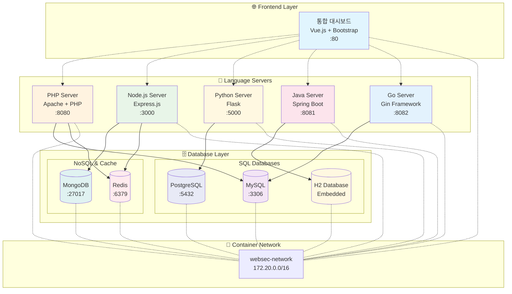
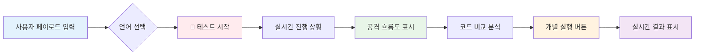
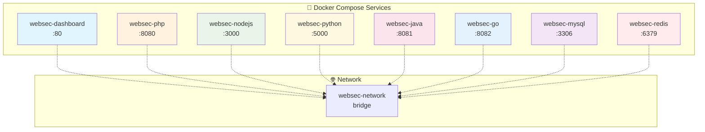

# WebSec-Lab v2 🛡️

**차세대 멀티 언어 웹 보안 취약점 테스트 플랫폼**

> 🎯 **단일 카드 UI로 직관적 학습** | 🌍 **5개 언어 XSS 지원** | 📊 **시각적 공격 흐름도**

## 🚀 빠른 시작

### 통합 대시보드로 XSS 테스트 시작 (추천)
```bash
make xss
```
**→ 접속: http://localhost** (통합 대시보드)
**→ 모든 언어의 XSS 테스트를 한 화면에서 비교**

### 개별 서버 테스트
```bash
make php      # PHP 서버: http://localhost:8080
make nodejs   # Node.js 서버: http://localhost:3000
make python   # Python 서버: http://localhost:5000
make java     # Java 서버: http://localhost:8081
make go       # Go 서버: http://localhost:8082
```

## 🏗️ 시스템 아키텍처



## 🎯 XSS 테스트 플랫폼

### ✨ **새로운 단일 카드 UI**
- **직관적 인터페이스**: 복잡한 Split View → 간단한 단일 카드
- **시각적 공격 흐름**: 👤 사용자 입력 → 🌐 서버 처리 → 💻 브라우저 결과
- **실시간 실행**: 취약/안전 코드를 각각 버튼으로 바로 테스트
- **언어별 비교**: 5개 언어의 XSS 구현을 한 화면에서 비교

### 🌍 **지원 언어 및 상태**

| 언어 | 프레임워크 | 취약한 코드 | 안전한 코드 | 상태 |
|------|------------|-------------|-------------|------|
| 🐘 **PHP** | Native | `echo $_GET['input']` | `htmlspecialchars()` | ✅ **완료** |
| 💚 **Node.js** | Express | 직접 출력 | HTML 이스케이프 | ✅ **완료** |
| 🐍 **Python** | Flask | `f-string` 직접 출력 | `html.escape()` | ✅ **완료** |
| ☕ **Java** | Spring Boot | 직접 문자열 연결 | `HtmlUtils.htmlEscape()` | ✅ **완료** |
| 🐹 **Go** | Gin | `c.String()` 직접 출력 | `html.EscapeString()` | ✅ **완료** |

### 📊 **테스트 기능**



## 🧪 XSS 페이로드 라이브러리

### 🚀 **기본 테스트**
```html
<script>alert("XSS")</script>
```

### 🖼️ **이미지 태그 우회**
```html

```

### 🎨 **SVG 벡터**
```html
<svg onload=alert("XSS")>
```

### 👆 **이벤트 핸들러**
```html
" onmouseover="alert('XSS')" "
```

### 🔤 **대소문자 우회**
```html
<ScRiPt>alert("XSS")</ScRiPt>
```

### 🖥️ **iframe 스크립트**
```html
<iframe src="javascript:alert('XSS')">
```

## 🎓 교육적 특징

### 📚 **비교 학습**
- **취약한 코드**: 실제 XSS 공격이 성공하는 코드
- **안전한 코드**: 같은 기능이지만 보안이 적용된 코드
- **언어별 차이**: 각 언어의 고유한 보안 방법 비교

### 🔍 **시각적 분석**
- **공격 흐름도**: XSS 동작 원리를 단계별로 시각화
- **실시간 결과**: 버튼 클릭으로 즉시 코드 실행 결과 확인
- **상태 표시**: 공격 성공/실패를 직관적 아이콘으로 표시

## 🛠️ 관리 명령어

### 🎯 **주요 명령어**
```bash
make help      # 📖 전체 명령어 도움말
make xss       # 🚀 XSS 테스트 환경 시작 (추천)
make status    # 📊 컨테이너 상태 확인
make logs      # 📝 실시간 로그 보기
make stop      # ⏹️ 모든 컨테이너 중지
make clean     # 🧹 완전 정리 (볼륨 포함)
make restart   # 🔄 빠른 재시작
```

### 🧪 **테스트 명령어**
```bash
make test-xss  # 🎯 XSS 자동 테스트
make test-api  # 🔌 API 엔드포인트 테스트
```

## 🌐 접속 주소

| 서비스 | URL | 설명 | 상태 |
|--------|-----|------|------|
| **통합 대시보드** | http://localhost | 모든 언어 통합 테스트 | ✅ **운영중** |
| PHP Server | http://localhost:8080 | PHP XSS 엔드포인트 | ✅ 완료 |
| Node.js Server | http://localhost:3000 | Express XSS 엔드포인트 | ✅ 완료 |
| Python Server | http://localhost:5000 | Flask XSS 엔드포인트 | ✅ 완료 |
| Java Server | http://localhost:8081 | Spring Boot XSS 엔드포인트 | ✅ 완료 |
| Go Server | http://localhost:8082 | Gin XSS 엔드포인트 | ✅ 완료 |

## 💻 XSS 엔드포인트 API

### 📡 **모든 언어 공통 API**
```bash
# 취약한 엔드포인트
GET /{language-server}/xss/vulnerable?input=<script>alert("XSS")</script>

# 안전한 엔드포인트
GET /{language-server}/xss/safe?input=<script>alert("XSS")</script>
```

### 🔍 **테스트 예시**
```bash
# PHP 취약한 엔드포인트
curl "http://localhost:8080/xss/vulnerable?input=<script>alert('XSS')</script>"

# Node.js 안전한 엔드포인트
curl "http://localhost:3000/xss/safe?input=<script>alert('XSS')</script>"

# Python 취약한 엔드포인트
curl "http://localhost:5000/xss/vulnerable?input=<script>alert('XSS')</script>"
```

## 🚀 현재 구현 현황

### ✅ **Phase 1 완료**
- [x] **Docker 환경 구축** - Multi-container 네트워크
- [x] **언어별 서버 구현** - PHP, Node.js, Python, Java, Go
- [x] **XSS 모듈 완전 구현** - 모든 언어
- [x] **통합 대시보드** - Vue.js 기반 단일 카드 UI
- [x] **시각적 공격 흐름도** - Mermaid 다이어그램
- [x] **실시간 테스트 실행** - 개별 버튼 실행

### 🔄 **Phase 2 진행중**
- [ ] **SQL Injection** - 다중 데이터베이스 환경
  - PHP → MySQL
  - Node.js → MongoDB
  - Python → PostgreSQL
  - Java → H2 Database
  - Go → MySQL
- [ ] Command Injection - 모든 언어
- [ ] File Upload Vulnerabilities
- [ ] CSRF Protection Bypass

### 📋 **Phase 3 계획**
- [ ] Server-Side Template Injection (SSTI)
- [ ] XXE (XML External Entity)
- [ ] SSRF (Server-Side Request Forgery)
- [ ] NoSQL Injection

## 🔒 보안 주의사항

⚠️ **경고**: 이 프로젝트는 **교육 목적으로만** 사용해야 합니다.

### 🚫 **금지사항**
- 프로덕션 환경에서 사용 금지
- 공개 네트워크에 노출 금지
- 실제 웹사이트 공격 도구로 사용 금지

### ✅ **허용사항**
- 격리된 로컬 환경에서만 사용
- 학습 및 연구 목적으로만 사용
- 보안 교육 및 훈련 용도

## 🎭 XSS 시나리오

| 시나리오 | 설명 | 실제 사용 예 |
|----------|------|-------------|
| **기본 웹페이지** | 사용자 입력을 그대로 출력 | 게시판, 댓글 시스템 |
| **검색 결과** | 검색어를 결과 페이지에 표시 | 검색 엔진, 쇼핑몰 검색 |
| **사용자 인사말** | 로그인한 사용자 이름 표시 | 개인화된 환영 메시지 |
| **폼 입력 결과** | 폼 제출 후 입력값 재표시 | 연락처 폼, 설문조사 |

## 🧪 언어별 XSS 구현 차이점

### 🐘 **PHP**
```php
// 취약: 직접 출력
echo $_GET['input'];

// 안전: HTML 이스케이프
echo htmlspecialchars($_GET['input'], ENT_QUOTES, 'UTF-8');
```

### 💚 **Node.js**
```javascript
// 취약: 템플릿 리터럴 직접 삽입
res.send(`<h1>User Input: ${input}</h1>`);

// 안전: HTML 이스케이프 함수 사용
const escapeHtml = (text) => text.replace(/[&<>"']/g, ...);
```

### 🐍 **Python**
```python
# 취약: f-string 직접 삽입
return f'<h1>User Input: {user_input}</h1>'

# 안전: html.escape() 사용
import html
return f'<h1>User Input: {html.escape(user_input)}</h1>'
```

### ☕ **Java**
```java
// 취약: 문자열 직접 연결
return "<h1>User Input: " + input + "</h1>";

// 안전: HtmlUtils 사용
String safeInput = HtmlUtils.htmlEscape(input);
return "<h1>User Input: " + safeInput + "</h1>";
```

### 🐹 **Go**
```go
// 취약: 직접 출력
c.String(200, "<h1>User Input: %s</h1>", input)

// 안전: html.EscapeString() 사용
safeInput := html.EscapeString(input)
c.String(200, "<h1>User Input: %s</h1>", safeInput)
```

## 📊 Docker 컨테이너 구성



## 🤝 기여하기

1. Fork the Project
2. Create your Feature Branch (`git checkout -b feature/AmazingFeature`)
3. Commit your Changes (`git commit -m 'Add some AmazingFeature'`)
4. Push to the Branch (`git push origin feature/AmazingFeature`)
5. Open a Pull Request

## 📄 라이선스

이 프로젝트는 교육 목적으로 MIT 라이선스 하에 배포됩니다.

## 🙏 감사의 말

- [PayloadsAllTheThings](https://github.com/swisskyrepo/PayloadsAllTheThings) - 실제 공격 페이로드 데이터베이스
- OWASP 프로젝트 - 웹 보안 가이드라인
- 각 언어별 보안 커뮤니티
- Vue.js, Bootstrap, Prism.js 오픈소스 프로젝트

---

## 📝 최신 업데이트

### 🎉 **v2.2.0 (2025-09-23)**
- ✨ **단일 카드 UI 혁신**: 복잡한 Split View → 직관적 단일 카드
- 🎨 **시각적 공격 흐름도**: 👤→🌐→💻 XSS 동작 원리 시각화
- 🔗 **5개 언어 XSS 완전 구현**: PHP, Node.js, Python, Java, Go
- ⚡ **실시간 코드 실행**: 취약/안전 코드 개별 버튼 실행
- 📱 **반응형 디자인**: 모바일 최적화 완료
- 🎓 **교육적 가치 극대화**: 공격 원리와 방어 방법 직관적 학습

### v2.1.0 (2024-09-22)
- 🎉 XSS 모듈 완전 구현 (PHP)
- ✅ 53개 테스트 100% 성공
- 🧪 자동화된 테스트 프레임워크 구축
- 🐳 Docker 환경 통합 및 정리

---

**WebSec-Lab v2** - 안전한 환경에서 배우는 웹 보안 🛡️