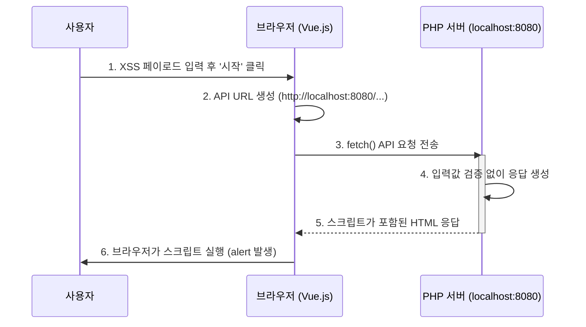

# XSS API 요청 흐름 (실제 코드 기반)

### **Slide 1: 사용자의 액션 (Vue.js)**

사용자가 Vue.js로 제어되는 UI와 상호작용하며 API 요청을 시작합니다.

**Code (`dashboard/public/index.html`):**
```html
<!-- XSS 페이로드를 입력하는 부분 -->
<textarea v-model="xssPayload" ...></textarea>

<!-- 테스트 시작 버튼. 클릭 시 executeXSSTest 메소드 호출 -->
<button @click="executeXSSTest" ...>
    {{ isLoading ? '테스트 중...' : '시작' }}
</button>
```

**설명:**
"사용자가 테스트할 XSS 페이로드를 입력하고 '시작' 버튼을 클릭합니다. Vue.js로 만들어진 이 화면은 버튼 클릭 시 `executeXSSTest` 라는 자바스크립트 메소드를 호출하도록 연결되어 있습니다."

---

### **Slide 2: 이벤트 처리 및 API URL 생성**

`dashboard.js`가 클릭 이벤트를 받아, 어떤 서버로 요청을 보낼지 결정하고 최종 URL을 동적으로 생성합니다.

**Code (`dashboard/assets/js/dashboard.js`):**
```javascript
// ...
methods: {
    // '시작' 버튼 클릭 시 호출되는 메소드
    async executeXSSTest() {
        // ...
        // 1. 현재 선택된 언어의 서버 URL을 가져옴
        const serverUrl = this.getCurrentServerUrl(); 
        
        // 2. 실제 테스트를 수행하는 메소드 호출
        const testResults = await this.testXSSEndpoints(serverUrl, this.xssPayload);
        // ...
    },

    // 선택된 언어에 맞는 포트번호로 URL을 생성
    getCurrentServerUrl() {
        const server = this.languageServers[this.selectedLanguage];
        return `http://localhost:${server.port}`; // 예: http://localhost:8080
    }
}
```

**설명:**
"`dashboard.js` 파일의 `executeXSSTest` 메소드가 호출됩니다. 이 메소드는 `getCurrentServerUrl`을 통해 선택된 서버의 포트번호(예: PHP는 8080)를 확인하고, `http://localhost:8080` 과 같은 최종 요청 URL을 만듭니다."

---

### **Slide 3: API 요청 전송 (Fetch API)**

생성된 URL과 페이로드를 담아 브라우저의 `fetch` API를 통해 백엔드 서버로 직접 요청을 보냅니다.

**Code (`dashboard/assets/js/dashboard.js`의 `testXSSEndpoints` 메소드 일부):**
```javascript
async testXSSEndpoints(serverUrl, payload) {
    // ...
    // 1. 취약한 엔드포인트 URL 생성
    const vulnerableUrl = `${serverUrl}/xss/vulnerable?input=${encodeURIComponent(payload)}`;
    
    // 2. fetch API로 직접 요청 전송
    const vulnerableResponse = await fetch(vulnerableUrl, { mode: 'cors' });
    
    const vulnerableContent = await vulnerableResponse.text();
    // ...
}
```

**설명:**
"자바스크립트는 동적으로 생성된 URL(예: `http://localhost:8080/xss/vulnerable?input=<script>...`)을 `fetch` API를 사용해 호출합니다. 여기서 중요한 점은 **Nginx를 거치지 않고, 브라우저에서 백엔드 서버의 해당 포트로 직접 HTTP 요청을 보낸다**는 것입니다."

---

### **Slide 4: 포트 포워딩 (Docker)**

브라우저가 보낸 요청이 어떻게 올바른 컨테이너로 전달되는지 Docker의 포트 설정으로 설명합니다.

**Code (`docker-compose.yml`):**
```yaml
services:
  php-server:
    build: ./servers/php-server
    ports:
      - "8080:80" # Host의 8080 포트를 컨테이너의 80 포트로 연결
```

**설명:**
"브라우저가 `localhost:8080`으로 보낸 요청은 `docker-compose.yml`의 `ports` 설정 덕분에 `php-server` 컨테이너의 80번 포트로 정확하게 전달됩니다. 각 서버는 이렇게 고유의 포트 번호를 통해 외부와 통신합니다."

---

### **Slide 5: 취약점 발생 및 응답 (PHP)**

PHP 서버가 요청을 받아 처리하고, 검증되지 않은 입력을 그대로 응답에 포함시켜 XSS 취약점이 발생합니다.

**Code (`servers/php-server/src/Vulnerabilities/XSS/ReflectedXSS.php`):**
```php
// (dashboard/assets/js/vulnerabilities/xss.js 에 명시된 예시 코드)

// 취약한 코드 - XSS 공격에 노출
echo $_GET['input']; // 사용자 입력을 필터링 없이 그대로 출력
```

**설명:**
"마지막으로, 요청을 받은 PHP 서버는 `input` 파라미터로 들어온 악성 스크립트를 아무런 처리 없이 그대로 HTML 응답에 포함시켜 되돌려줍니다. 이 응답을 받은 브라우저는 서버를 신뢰하기 때문에 포함된 스크립트를 그대로 실행하게 되고, XSS 공격이 성공합니다."

---

### **워크플로우 다이어그램 (Mermaid)**


